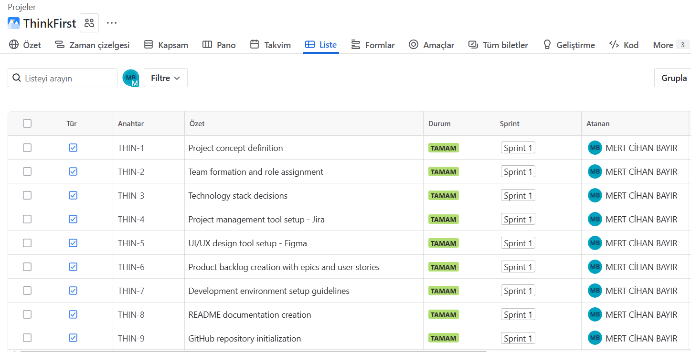
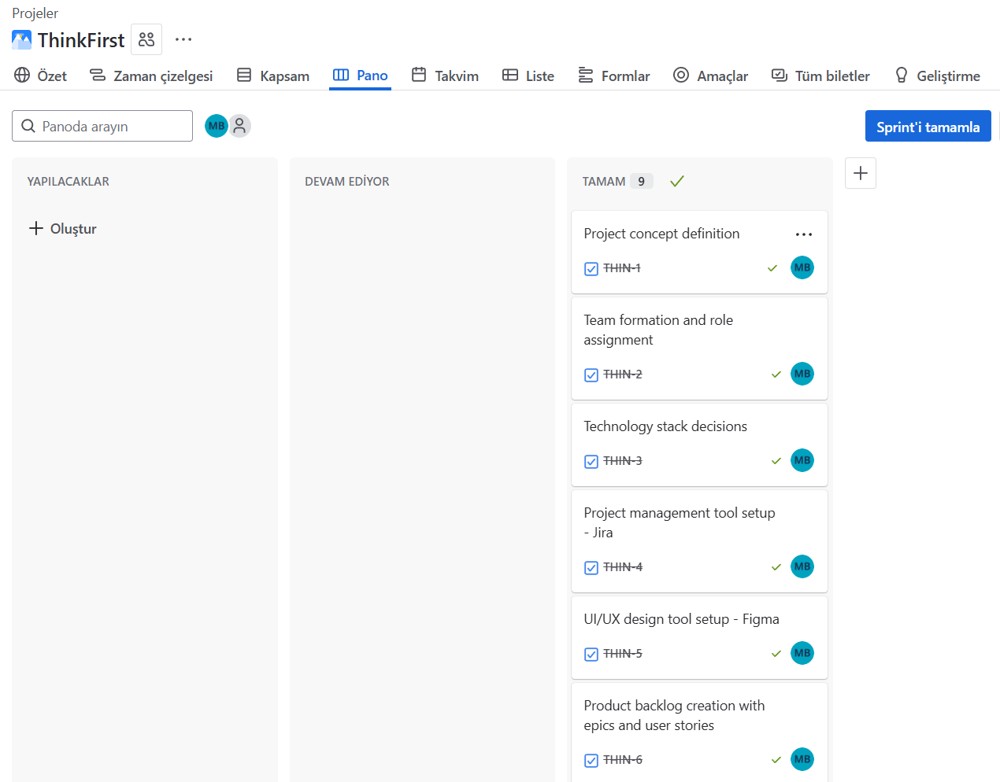
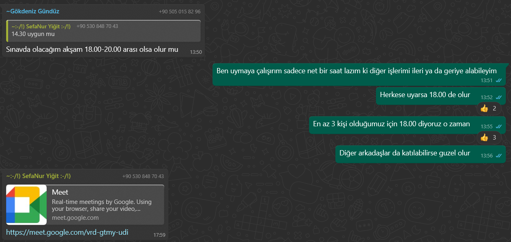
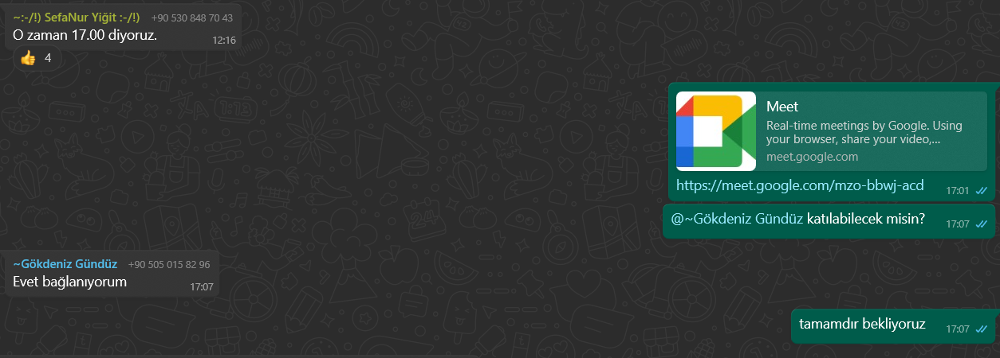
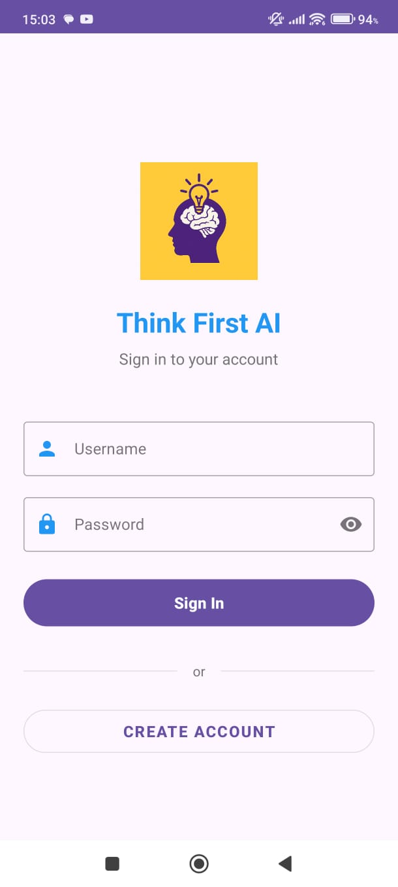
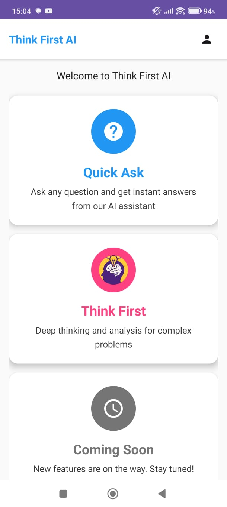
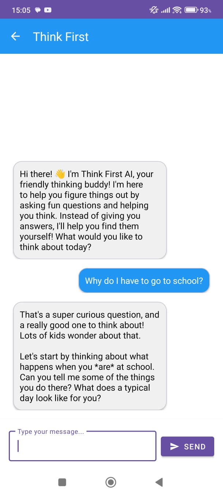
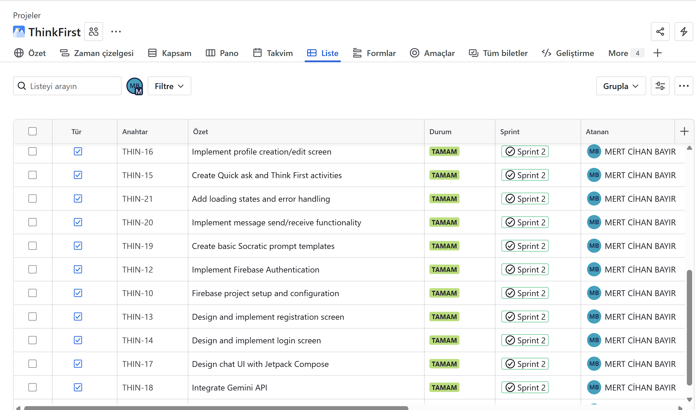
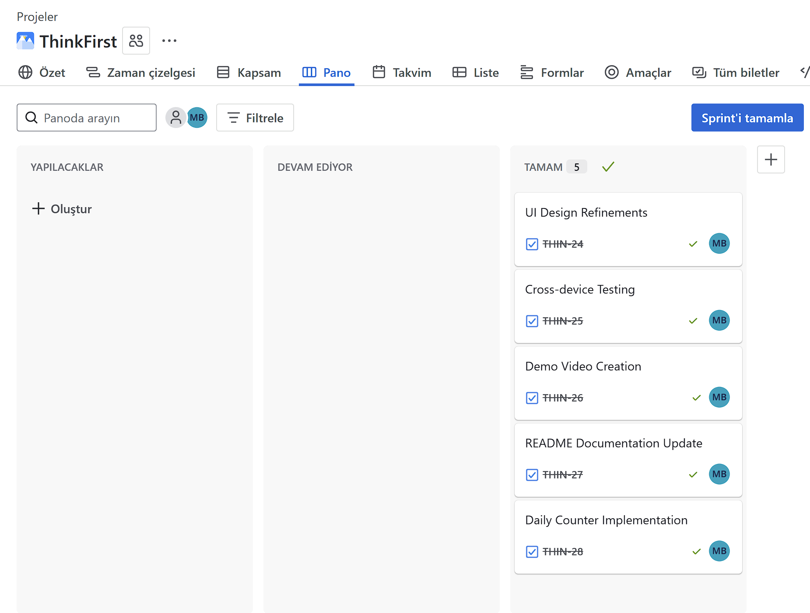

# 🧠 ThinkFirst AI - Learning Through Thinking Platform

## 👥 Team & Product Name
**Team Name**: ThinkFirst AI  
**Product Name**: ThinkFirst - Socratic Learning Assistant

## 📋 Information About Team and Product

### Team Members
| Name | Title | Socials |
|------|-------|---------|
| Gökdeniz Gündüz | Scrum Master | [LinkedIn](https://www.linkedin.com/in/gokdeniz-gunduz) / [GitHub](https://github.com/GokdenizGunduz) |
| Mert Cihan Bayır | Product Owner | [LinkedIn](https://www.linkedin.com/in/mertcihanbayır/) / [GitHub](https://github.com/MertCihan74) |
| Sefa Nur Yiğit | Developer | [LinkedIn](https://www.linkedin.com/in/sefanur-yiğit) / [GitHub](https://github.com/ssefanurygt) |
| Sümeyye Açıkgöz | Developer | [LinkedIn](https://www.linkedin.com/in/s%C3%BCmeyye-a%C3%A7%C4%B1kg%C3%B6z-a3a22b2b2/) / [GitHub](https://github.com/sumeyyeacikgoz) |
| Mehmet Yusuf Bayat | Developer | [LinkedIn/GitHub] |

### Product Description
ThinkFirst is an innovative AI learning platform designed to enhance analytical thinking skills in children and young adults. Unlike traditional AI assistants, it employs the Socratic method to encourage users to think critically rather than providing direct answers. The platform asks age-appropriate questions tailored to the user's knowledge level, helping them reach solutions independently. This approach promotes active learning and problem-solving skills instead of passive information consumption.

While ThinkFirst appears to be an educational project, it also has significant positive impacts in the healthcare domain alongside education. By preventing young people and children from reaching direct answers, it aims to prevent mental health issues such as cognitive decline and memory problems. The platform encourages active brain engagement, which is crucial for maintaining cognitive health and preventing the deterioration of thinking abilities that can result from over-reliance on instant information access.

### Product Features

**Socratic Inquiry Engine:**
Utilizes Gemini API to guide users through thought-provoking questions and hints rather than providing direct answers.

**Age Group Adaptation:**
Provides interaction with appropriate language and complexity levels based on user's age and educational level.

**Interactive Dialog System:**
Creates a dynamic conversation environment offering step-by-step learning experiences.

**Multi-Subject Support:**
Offers assistance across various subjects including mathematics, science, social studies, and language learning.

**Gamification Elements:**
Daily question counter tracks and limits user interactions, encouraging consistent but measured usage. This feature is synchronized with Firebase Realtime Database to maintain usage statistics across sessions.

### Target Audience
ThinkFirst's target audience consists of students aged 8-18 and their parents. Specifically:
- Families wanting to develop their children's analytical thinking skills
- Students who prefer understanding over memorization while doing homework
- Teachers who support technology use in education
- Parents who want their children to use screen time productively

## 📊 Sprint 1 - Planning & Setup

### Sprint 1 - App Screenshots
*No screenshots available - Planning phase only*

### Sprint 1 - Sprint Board Update Screenshots
<table>
  <tr>
    <td align="center"><b>Jira Table View</b></td>
    <td align="center"><b>Jira Board View</b></td>
  </tr>
  <tr>
    <td></td>
    <td></td>
  </tr>
</table>

### Sprint 1 - Figma Design

### Sprint 1 - Daily Scrum
The team established daily scrum meetings to communication and progress tracking.
<table>
  <tr>
    <td align="center"><b>Meet 1</b></td>
    <td align="center"><b>Meet 2</b></td>
  </tr>
  <tr>
    <td></td>
    <td></td>
  </tr>
</table>

**Daily Scrum Details:**
- **Meeting Platform**: Google Meet for formal daily scrums
- **Communication Channel**: WhatsApp for day-to-day discussions
- **Meeting Duration**: 15 minutes
  
### Sprint Notes:
Sprint 1 was dedicated to project planning, team formation, and initial setup. No development work was undertaken during this sprint.

**Completed Planning Activities:**
- Project concept definition (3 pts) ✓
- Team formation and role assignment (2 pts) ✓
- Technology stack decisions (5 pts) ✓
- Project management tool setup - Jira (2 pts) ✓
- UI/UX design tool setup and creating basic UI mockup - Figma (2 pts) ✓
- Product backlog creation with epics and user stories (8 pts) ✓
- Development environment setup guidelines (3 pts) ✓
- README documentation creation (3 pts) ✓
- GitHub repository initialization (2 pts) ✓

**Technology Stack Finalized:**
- **Kotlin** for Android development
- **Firebase** ecosystem for backend services
- **Google Gemini API** for AI integration
- **Jetpack Compose** for UI development
- **Hilt** for dependency injection

**Expected point completion within Sprint**: 30 points

**Completed points**: 30 points (100% completion)

**Point Completion Logic**: Sprint 1 focused on planning activities with a total of 30 story points. All planning tasks were completed successfully. Development work will begin in Sprint 2 (100 points) and continue through Sprint 3 (100 points). Planning Poker method was used for story point estimation.

**Product Backlog URL**: [ThinkFirst AI Jira Board](https://thinkfirstai.atlassian.net/jira/software/projects/THIN/boards/35/backlog)

### Sprint Review:
The team successfully established the project foundation during Sprint 1. All planning deliverables were completed, including project concept definition, technology decisions, and comprehensive documentation. The product backlog has been populated with user stories for the next two sprints.

**Sprint Review Participants**: Gökdeniz Gündüz, Mert Cihan Bayır, Sefa Nur Yiğit, Sümeyye Açıkgöz, Mehmet Yusuf Bayat

### Sprint Retrospective:
**What went well:**
- Clear project vision established
- Comprehensive technology research completed
- Well-structured product backlog created

**What could be improved:**
- Need to finalize Figma access for all team members
- Set up development environments before Sprint 2
- Create more detailed acceptance criteria for user stories

**Action items for Sprint 2:**
- Begin actual development work
- Implement core authentication features
- Set up Firebase project

### Other Notes:
**Sprint 2 Focus Areas:**
- Firebase setup and configuration
- User authentication implementation
- Basic chat UI development
- Initial Gemini API integration

## 📊 Sprint 2 - Core Development

### Sprint 2 - App Screenshots
<table>
  <tr>
    <td align="center"></td>
    <td align="center"></td>
    <td align="center"></td>
  </tr>
</table>

### Sprint 2 - Sprint Board Update Screenshots

### Sprint 2 - Daily Scrum
Due to team members' conflicting schedules and various commitments during this sprint period, formal daily scrum meetings could not be conducted. Development work was carried out independently with asynchronous communication through WhatsApp. The team acknowledges the importance of regular scrum meetings and plans to implement a more structured meeting schedule in Sprint 3.

**Communication Method:**
- **Primary Channel**: WhatsApp for asynchronous updates
- **Work Distribution**: Individual task completion with periodic status updates

### Sprint Notes:
Sprint 2 focused on implementing core functionality and establishing the foundation for the ThinkFirst application.

**Completed Development Tasks:**
- Create Android project with Kotlin (3 pts) ✓
- Implement Firebase Authentication (8 pts) ✓
- Design and implement registration screen (8 pts) ✓
- Design and implement login screen (7 pts) ✓
- Create Quick ask and Think First activities (10 pts) ✓
- Implement profile creation/edit screen (8 pts) ✓
- Design chat UI (10 pts) ✓
- Integrate Gemini API (13 pts) ✓
- Create basic Socratic prompt templates (10 pts) ✓
- Implement message send/receive functionality (9 pts) ✓
- Add loading states and error handling (6 pts) ✓
- Basic unit tests for core features (6 pts) ✓
- Update README.md (2 pts) ✓

**Key Achievements:**
- Successfully integrated Firebase for user authentication and data storage
- Implemented core UI screens with Jetpack Compose
- Established connection with Gemini API for AI-powered responses
- Created foundation for Socratic questioning methodology
- Implemented two main activity modes: Quick Ask and Think First

**Expected point completion within Sprint**: 100 points

**Completed points**: 100 points (100% completion)

**Point Completion Logic**: Sprint 2 targets 100 points focusing on core functionality development. Tasks include Firebase setup, authentication implementation, basic UI development, and initial Gemini API integration.

**Product Backlog URL**: [ThinkFirst AI Jira Board](https://thinkfirstai.atlassian.net/jira/software/projects/THIN/boards/35/backlog)

### Sprint Review:
Due to various academic and personal commitments, team members faced significant time constraints during Sprint 2. Despite these challenges, the core development work was carried forward to ensure project continuity. The sprint deliverables were completed with individual effort, demonstrating commitment to the project goals even under challenging circumstances.

**Key Outcomes:**
- Core authentication system successfully implemented
- Basic chat functionality operational with Gemini API integration
- User interface screens completed for main user flows
- Foundation laid for Socratic questioning methodology

**Sprint Review Participants**: Mert Cihan Bayır

### Sprint Retrospective:
**What went well:**
- Project reached the targeted development milestone despite challenges
- Core features were successfully implemented as planned
- Technical architecture proved to be solid and scalable
- Firebase integration worked smoothly without major issues
- UI/UX design met the intended user-friendly approach

**What could be improved:**
- Team collaboration was limited due to time constraints
- Knowledge gaps in technical stack among some team members hindered contribution
- Need for better work distribution based on team members' availability
- Lack of regular communication affected team synchronization
- Documentation of code could be more comprehensive for team onboarding

**Action items for Sprint 3:**
- Establish more flexible meeting times to accommodate all team members
- Create technical documentation and tutorials for team knowledge sharing
- Implement pair programming sessions to bridge knowledge gaps
- Set up clearer task assignments based on individual availability
### Other Notes:
**Sprint 3 Focus Areas:**
- Advanced features implementation
- UI/UX polish
- Testing and optimization
- Final deployment preparation

## 📊 Sprint 3 - Final Polish & Delivery

### Sprint 3 - App Demo
**Project Demo Video**: [Watch ThinkFirst AI Demo](https://youtube.com/shorts/CZr8mFpOPQE?feature=share)

*Demo video showcases the complete application functionality, including:*
- User registration and authentication
- Main interface navigation
- Socratic questioning in action
- Age-appropriate responses
- User profile and settings
### Sprint 3 - Sprint Board Update Screenshots

### Sprint 3 - Daily Scrum
During Sprint 3, the development work continued as an individual effort without formal team meetings or regular communication sessions. All tasks were handled by a single team member due to continued availability challenges with the rest of the team.

**Communication Method:**
- **Primary Channel**: None
- **Work Distribution**: All tasks completed by individual effort

### Sprint Notes:
Sprint 3 focused on polishing the application, implementing final features, and preparing for delivery.

**Planned Development Tasks:**
- UI Design Refinements (8 pts)
- Cross-device Testing (8 pts)
- Demo Video Creation (10 pts)
- README Documentation Update (7 pts)
- Daily Counter Implementation (12 pts)

**Key Objectives:**
- Enhance visual appeal and user experience
- Ensure application stability across different devices
- Document application features and usage for end users
- Create showcase material for presentation
- Implement usage tracking for better user experience control

**Expected point completion within Sprint**: 45 points

**Completed points**:  45 points (100% completion)

**Point Completion Logic**: Sprint 3 targets 45 points focusing on application refinement and preparation for final delivery. After completing Sprints 1 (30 pts) and 2 (100 pts), this final sprint will bring the total project completion to 175 points.

**Product Backlog URL**: [ThinkFirst AI Jira Board](https://thinkfirstai.atlassian.net/jira/software/projects/THIN/boards/35/backlog)

### Sprint Review:
The Sprint 3 review was conducted as an individual assessment of completed work. All planned features were implemented successfully, with particular focus on UI refinements and cross-device compatibility. The application is now ready for demonstration and presentation.

**Sprint Review Participants**: Mert Cihan Bayır

### Sprint Retrospective:
**What went well:**
- All planned features were implemented successfully
- Application performance meets expectations
- UI refinements significantly improved user experience
- Documentation thoroughly covers all aspects of the application
- Final product aligns well with initial project vision

**What could be improved:**
- Team collaboration remained a significant challenge throughout the project
- Knowledge sharing opportunities were limited
- Development workload was unevenly distributed
- Project management tools were underutilized by most team members
- More comprehensive testing across diverse devices would be beneficial

**Lessons learned for future projects:**
- Establish clearer expectations for team participation from the outset
- Consider team members' technical backgrounds when assigning roles
- Implement mandatory check-in mechanisms even for remote/asynchronous work
- Provide more structured onboarding for team members unfamiliar with the tech stack
- Plan for contingencies in case of uneven workload distribution

### Other Notes:
**Project Completion Highlights:**
- Total development across 3 sprints: 175 story points
- Fully functional Socratic learning application with AI integration
- Firebase backend with authentication and data storage
- Age-appropriate learning guidance system

## 📱 Application Download
**Download ThinkFirst AI APK**: [Download Link](https://drive.google.com/file/d/1QoPspqJU9uR4DKgFXtYW1psMJnS943Sp/view?usp=sharing)
